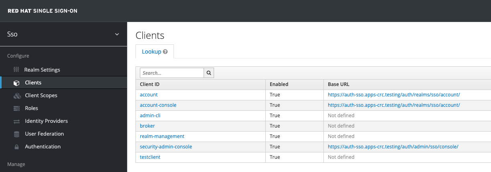
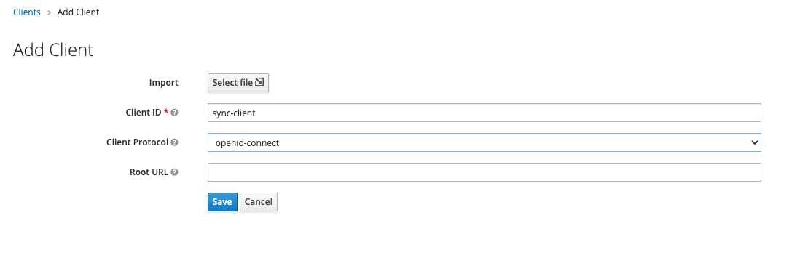
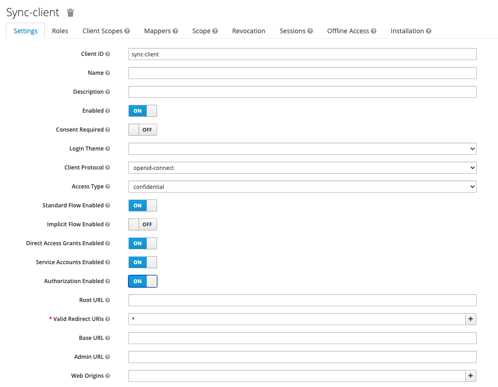
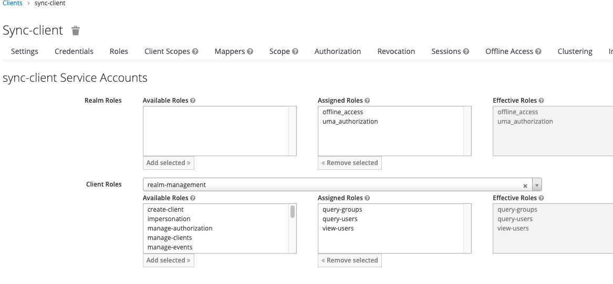
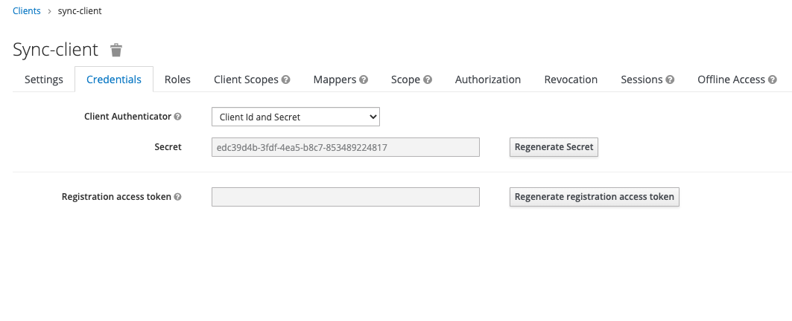

# Keylcloak Sync

A command to sync groups from Keycloak/Red Hat SSO to OpenShift. This command uses a KeyClock client to read the
configuration of a realm in Keycloak and then outputs yaml for the required Group(s) object(s) for OpenShift to 
consume.

## Problem Statement
Typically, when setting up Keyloak/RH SSO as an OpenShift Authentication Provider, there is a disconnect between the
user/group mapping in Keycloak and the User/Group objects found in OpenShift. This go command aims to bridge that gap
by providing a tool that can be automated and used to bridge that gap.

When a user first logs in with an identity provider an OpenShift `User` resource is created with an `Identity` resource
that serves as the link between the Identity Provider and the OpenShift OAuth mechanism.  What is missing is the group
information provided by the IdM to allow roles to be bound to the OpenShift groups and ease the overhead of administration.

With OpenShift there is the [ldap-sync command](https://docs.openshift.com/container-platform/4.5/authentication/ldap-syncing.html) which
`keycloak-sync` aims to replicate to a degree. Prior to this command you would need to sync information from any backing LDAP/AD 
implementations to OpenShift and skip over Keycloak in order to have any kind of sync. This ignores any User Federation as well
as multiple LDAP/AD sources or Multiple Realm cluster capability. It is the aim of `keycloak-sync` to close all those gaps.

## Compatibility
This was tested with OpenShift 4.5 and RH SSO 7.4 but there is no real reason this won't work with OpenShift as far back
as 3.9 and earlier version of Keycloak/RH SSO. Please create issues for problems with other versions. 

## Keycloak/SSO Configuration

The Keycloak configuration requires a client for the target realm. This client has limited permissions (can only
query groups and users and can only view users). This client should not be able to do more than view/query information to 
prevent credentials from leaking and/or the improper use of the operator client.

From the "Clients" sidebar item click "Create" on the far right of the screen to create a new client.


Fill out the screen as shown with a descriptive client name (sync-client) and the openid-connect protocol. Click save.


Set the "Access Type" to "confidential" and ensure that both "Service Accounts Enabled" and "Authorization Enabled" are "ON".
Click save.


On the "Service Account Roles" tab use the "Client Roles" box to search for and select "realm-management". Then add the
"query-groups", "query-users", and "view-users" roles.


Go to the "Credentials" tab and copy the value from the "Secret" field. This will be used to authenticate the client.


## Configuring keycloak-sync
The configuration of keycloak comes from a yaml file. A [sample yaml](keycloak-sample-config.yml) is provided with 
comments for all the options.

### Merge Behavior
TODO

### Prune Behavior
TODO

## Command Line Options
Keycloak Sync takes the following command line options:
```
-c : the path to the keycloak configuration. this is required.
-g : the path to the input openshift groups in yaml or json format. the output of the command will be
     only the changes in group files needed to bring the groups in OpenShipt up to date with keycloak. 
     if the config option "prune" is enabled then entries that are not in keycloak will be deleted. 
```

## Executing keycloak-sync
To execute the keycloak sync simply execute the binary `keycloak-sync -c ks.yml` with it pointing at the configuration file:
```bash
[host]$ ./keycloak-sync -c ks.yml
---
apiVersion: user.openshift.io/v1
kind: Group
metadata:
  name: sso-administrators-dev
  annotations:
    "keycloak-sync/last-primary-source": "realm:sso"
    "keycloak-sync/realms": ""
users:
- test2
---
apiVersion: user.openshift.io/v1
kind: Group
metadata:
  name: sso-developers-dev
  annotations:
    "keycloak-sync/last-primary-source": "realm:sso"
    "keycloak-sync/realms": ""
users:
- test1
- test2
- test3
```

To execute the sync using your openshift groups as a reference execute the binary providing a list of groups from openshift:
```bash
[host]$ oc get groups -o yaml | ./keycloak-sync -c ks.yml -g - | oc create --save-config -f -
group.user.openshift.io/sso-administrators-dev created
group.user.openshift.io/sso-developers-dev created
[host]$ oc get groups -o yaml | ./keycloak-sync -c ks.yml -g -
```
There will be no output after the second command because no groups have changed and nothing needs to be synchronized.

If you have the "prune" option set to true and you edit a group and then run the sync again you will get a group back to override the existing group:
```bash
[host]$ oc edit group sso-developers-dev # edit this group and add "test4"
[host]$ oc get groups -o yaml | go run cmd/keycloak-sync.go -c keycloak-sample-config.yml -g -
---
apiVersion: user.openshift.io/v1
kind: Group
metadata:
  name: sso-developers-dev
  annotations:
    "keycloak-sync/last-primary-source": "openshift"
    "keycloak-sync/realms": "sso"
users:
- test1
- test2
- test3
[host]$ oc get groups -o yaml | go run cmd/keycloak-sync.go -c keycloak-sample-config.yml -g - | oc apply -f -
group.user.openshift.io/sso-developers-dev configured
```

## Build Instructions
Simple, single build:
```
go mod download
go build cmd/keycloak-sync.go
```